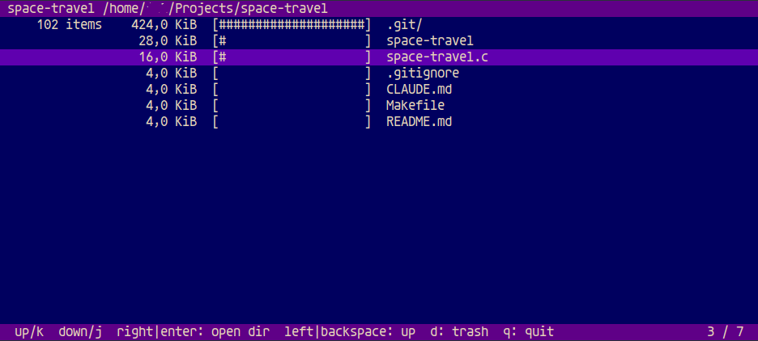

# space-travel

A minimal terminal disk usage browser, inspired by [ncdu](https://dev.yorhel.nl/ncdu). Written in C with ncurses.



## Build

Requires ncurses. On Debian/Ubuntu: `apt install libncurses-dev`.

```sh
make
```

## Usage

```sh
./space-travel [path]   # defaults to current directory
```

space-travel scans the given path, then opens an interactive browser sorted by disk usage (largest first).

## Keys

| Key | Action |
|-----|--------|
| `j` / `down` | Move down |
| `k` / `up` | Move up |
| `enter` / `right` | Enter directory |
| `backspace` / `left` | Go up to parent |
| `q` | Quit |

## Design

- Single C file, ~350 lines.
- Uses `lstat` only — symlinks are never followed.
- Recursion capped at depth 128 to prevent stack overflow.
- All path construction bounds-checked with `snprintf`.
- No dependencies beyond libc and ncurses.
